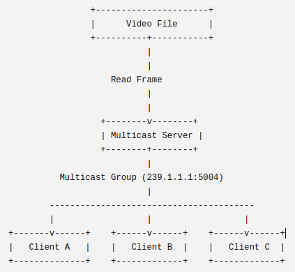

# Socket Programming Project: Video Streaming using IP Multicast

## Mô tả (Description)

Xây dựng một ứng dụng streaming video qua multicast. Server liên tục phát (broadcast) các khung hình video MJPEG tới một multicast group, và nhiều client tham gia group đó để xem stream. Không yêu cầu sử dụng RTSP, RTP, lựa chọn TCP/UDP, hay kênh điều khiển/dữ liệu riêng biệt.

## Kiến trúc (Architecture)

```
Server -> Multicast Group (239.1.1.1:5004) -> Multiple Clients
```



## Yêu cầu chức năng (Functional Requirements)

### Server

- Đọc file video MJPEG theo từng khung hình (frame).
- Đóng gói (packetize) từng frame.
- Gửi mỗi frame tới địa chỉ IP multicast.
- Phát khung hình ở tốc độ xấp xỉ 20 FPS (50 ms/frame).
- Tiếp tục streaming cho đến khi video kết thúc.
- Tự động phát lại video từ đầu khi đến frame cuối cùng.

### Client

- Tham gia (join) multicast group.
- Nhận các gói tin multicast.
- Giải mã (decode) các gói tin nhận được.
- Hiển thị video theo thời gian thực.
- Rời (leave) multicast group khi thoát chương trình.

## Cách chạy chương trình (Running)

**Server:**
```
python Server.py <file MJPEG>
```

**Client:**
```
python Client.py
```

## Tiêu chí chấm điểm (Grading Rubric — 10 điểm)

| Yêu cầu (Requirement) | Điểm (Points) | Mô tả (Description) |
|---|---|---|
| Server implementation | 2.5 | Multicast server |
| Client implementation | 2.5 | Receive/display video |
| Packet format | 2.0 | Custom packet |
| Multiple clients & loss detection | 2.0 | Concurrency/statistics |
| Report | 1.0 | Architecture/testing |
