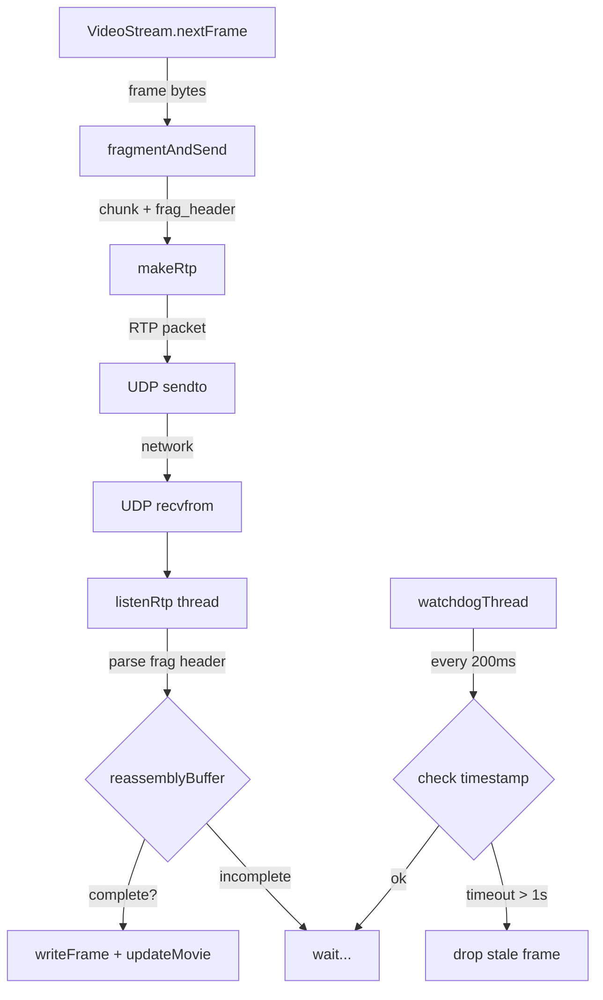

# UDP Fragmentation — với Out-of-Order Handling & Timeout Reset

## Tổng quan

Dự án RTP/RTSP stream video MJPEG qua UDP. Mỗi JPEG frame có thể lớn hơn nhiều lần so với MTU Ethernet (1500 bytes). Cần implement **application-level fragmentation** để:

1. **Server** chia frame thành các RTP packet ≤ MTU
2. **Client** reassemble lại đúng thứ tự dù fragment đến lộn xộn
3. **Client** tự động timeout reset buffer nếu fragment bị mất

---

## Thiết kế kỹ thuật chi tiết

### Hằng số MTU

```python
MAX_UDP_PAYLOAD   = 1400   # bytes (conservative, sau IP/UDP header)
RTP_HEADER_SIZE   = 12     # bytes (RTP standard header)
FRAG_HEADER_SIZE  = 4      # bytes (custom fragment header — xem bên dưới)
MAX_RTP_PAYLOAD   = MAX_UDP_PAYLOAD - RTP_HEADER_SIZE - FRAG_HEADER_SIZE  # = 1384 bytes
REASSEMBLY_TIMEOUT = 1.0   # giây — reset buffer nếu frame chưa hoàn chỉnh sau 1s
```

---

### Custom Fragment Header (4 bytes trong RTP payload)

Để xử lý **out-of-order**, mỗi RTP packet cần biết:
- Frame nào nó thuộc về?
- Nó là fragment thứ mấy?
- Tổng cộng có bao nhiêu fragment?

Ta thêm **4 bytes header tự định nghĩa** vào đầu RTP payload:

```
 0                   1                   2                   3
 0 1 2 3 4 5 6 7 8 9 0 1 2 3 4 5 6 7 8 9 0 1 2 3 4 5 6 7 8 9 0 1
+-+-+-+-+-+-+-+-+-+-+-+-+-+-+-+-+-+-+-+-+-+-+-+-+-+-+-+-+-+-+-+-+
|   frame_id (8 bits)           |  frag_index (8 bits)  |  total_frags (8 bits) | reserved (8 bits) |
+-+-+-+-+-+-+-+-+-+-+-+-+-+-+-+-+-+-+-+-+-+-+-+-+-+-+-+-+-+-+-+-+
```

| Field | Bits | Mô tả |
|-------|------|-------|
| `frame_id` | 8 | ID của frame (0–255, wrap-around) |
| `frag_index` | 8 | Chỉ số fragment bắt đầu từ 0 |
| `total_frags` | 8 | Tổng số fragment của frame này |
| `reserved` | 8 | Dự phòng (đặt = 0) |

> [!NOTE]
> Với 8 bits `frame_id`, ta có 256 giá trị, đủ để phân biệt frame hiện tại với frame cũ bị trễ. Với 8 bits `total_frags`, tối đa 255 fragments × 1384 bytes = **~352 KB** — đủ cho hầu hết JPEG frame.

**Cấu trúc packet hoàn chỉnh:**
```
[ RTP Header 12B ][ frag_header 4B ][ JPEG chunk data ≤ 1384B ]
```

---

### Server-side: Fragmentation

```
frame_data (e.g. 50000 bytes)
    ↓  chia thành chunks 1384B
chunk_0 → [RTP hdr][frame_id=5, idx=0, total=37, res=0][data 1384B]  marker=0
chunk_1 → [RTP hdr][frame_id=5, idx=1, total=37, res=0][data 1384B]  marker=0
  ...
chunk_36→ [RTP hdr][frame_id=5, idx=36,total=37, res=0][data ≤1384B] marker=1
```

- **`seqNum`**: tăng toàn cục, mỗi fragment một giá trị riêng (16-bit trong RTP header)
- **Marker bit = 1** chỉ ở fragment cuối cùng

---

### Client-side: Reassembly với Out-of-Order

```python
# Cấu trúc reassembly buffer
self.reassemblyBuffer = {}
# reassemblyBuffer[frame_id] = {
#     'fragments': {frag_index: payload_bytes, ...},
#     'total_frags': N,
#     'timestamp': time.time()   ← dùng để timeout
# }
```

**Logic nhận mỗi packet:**

```
recv RTP packet
    ↓
decode RTP header → seqNum, marker
parse frag_header → frame_id, frag_index, total_frags
extract actual_payload = packet[RTP_HEADER + FRAG_HEADER:]

if frame_id not in reassemblyBuffer:
    tạo entry mới với timestamp = now

reassemblyBuffer[frame_id]['fragments'][frag_index] = actual_payload
reassemblyBuffer[frame_id]['total_frags'] = total_frags

if len(fragments) == total_frags:
    → ghép fragments theo thứ tự index 0..N-1
    → displayFrame(assembled_data)
    → xóa entry khỏi reassemblyBuffer
```

---

### Watchdog Timer (Timeout Reset)

Một **thread riêng** chạy song song, kiểm tra định kỳ:

```python
def watchdogThread(self):
    """Xóa các frame bị stuck (mất fragment) khỏi reassembly buffer."""
    while not self.playEvent.isSet():
        time.sleep(0.2)  # check mỗi 200ms
        now = time.time()
        stale_frames = [
            fid for fid, info in self.reassemblyBuffer.items()
            if now - info['timestamp'] > REASSEMBLY_TIMEOUT
        ]
        for fid in stale_frames:
            print(f"[TIMEOUT] Frame {fid} incomplete — dropping "
                  f"({len(self.reassemblyBuffer[fid]['fragments'])}"
                  f"/{self.reassemblyBuffer[fid]['total_frags']} frags)")
            del self.reassemblyBuffer[fid]
```

---

## Sơ đồ luồng đầy đủ

```
SERVER                                       CLIENT
──────                                       ──────
nextFrame() → 50KB JPEG
fragmentAndSend():
  seqNum=100, frame_id=5, idx=0  ──────────→ reassemblyBuffer[5]['fragments'][0] = data
  seqNum=101, frame_id=5, idx=1  ──────────→ reassemblyBuffer[5]['fragments'][1] = data
  seqNum=102, frame_id=5, idx=2  ──X lost   (không nhận được)
  seqNum=103, frame_id=5, idx=3  ──────────→ reassemblyBuffer[5]['fragments'][3] = data
  seqNum=104, frame_id=5, idx=4  ──────────→ reassemblyBuffer[5]['fragments'][4] = data
    (marker=1, last)

  → Nhận đủ? KHÔNG (còn thiếu idx=2)
  → Watchdog sau 1.0s: [TIMEOUT] Frame 5 incomplete — dropping (4/5 frags)
  → reassemblyBuffer[5] bị xóa, chờ frame tiếp theo

nextFrame() → frame mới
  seqNum=105, frame_id=6, idx=0  ──────────→ reassemblyBuffer[6] tạo mới
  ...
  (hoàn chỉnh)                   ──────────→ writeFrame() + updateMovie()
```

---

## Các thay đổi cụ thể theo từng file

---

### Component 1: `RtpPacket.py`

#### [MODIFY] [RtpPacket.py](file:///d:/HCMUS/Ki_2_Nam_3/LTM/Project_01_cq/Project_01/skeleton_python_rtp/python_rtp/RtpPacket.py)

**Thêm method `marker()`** để đọc Marker bit từ header:

```python
def marker(self):
    """Return marker bit (1 = last fragment of a frame)."""
    return int((self.header[1] >> 7) & 0x01)
```

> [!NOTE]
> Không sửa `encode()` vì marker bit đã được encode đúng tại `header[1] = (marker << 7) | pt`. Chỉ cần thêm getter.

---

### Component 2: `ServerWorker.py`

#### [MODIFY] [ServerWorker.py](file:///d:/HCMUS/Ki_2_Nam_3/LTM/Project_01_cq/Project_01/skeleton_python_rtp/python_rtp/ServerWorker.py)

**Thêm constants ở đầu file:**
```python
MAX_UDP_PAYLOAD  = 1400
RTP_HEADER_SIZE  = 12
FRAG_HEADER_SIZE = 4
MAX_RTP_PAYLOAD  = MAX_UDP_PAYLOAD - RTP_HEADER_SIZE - FRAG_HEADER_SIZE  # 1384 bytes
```

**Sửa `__init__()`** — thêm counters:
```python
def __init__(self, clientInfo):
    self.clientInfo = clientInfo
    self.seqNum  = 0       # global RTP sequence number
    self.frameId = 0       # frame ID (0–255, wrap-around)
```

**Sửa `sendRtp()`** — gọi `fragmentAndSend()` thay vì `makeRtp()`:
```python
def sendRtp(self):
    while True:
        self.clientInfo['event'].wait(0.05)
        if self.clientInfo['event'].isSet():
            break
        data = self.clientInfo['videoStream'].nextFrame()
        if data:
            try:
                address = self.clientInfo['rtspSocket'][1][0]
                port    = int(self.clientInfo['rtpPort'])
                self.fragmentAndSend(data, address, port)
            except Exception as e:
                print("Connection Error:", e)
```

**Thêm method `fragmentAndSend()`:**
```python
def fragmentAndSend(self, data, address, port):
    """Chia frame thành các RTP fragment ≤ MAX_RTP_PAYLOAD và gửi qua UDP."""
    import math
    total_len   = len(data)
    total_frags = math.ceil(total_len / MAX_RTP_PAYLOAD)
    frame_id    = self.frameId & 0xFF  # wrap-around 8-bit

    for idx in range(total_frags):
        start   = idx * MAX_RTP_PAYLOAD
        chunk   = data[start : start + MAX_RTP_PAYLOAD]
        is_last = (idx == total_frags - 1)
        marker  = 1 if is_last else 0

        # Tạo fragment header 4 bytes
        frag_header = bytes([
            frame_id & 0xFF,
            idx & 0xFF,
            total_frags & 0xFF,
            0x00  # reserved
        ])

        payload = frag_header + chunk
        packet  = self.makeRtp(payload, self.seqNum, marker)
        self.clientInfo['rtpSocket'].sendto(packet, (address, port))
        self.seqNum += 1

    self.frameId = (self.frameId + 1) & 0xFF
    print(f"[TX] frame_id={frame_id}, {total_frags} fragments, {total_len} bytes")
```

**Sửa `makeRtp()`** — nhận `seqnum` và `marker` từ tham số:
```python
def makeRtp(self, payload, seqnum, marker=0):
    """RTP-packetize một chunk dữ liệu."""
    version   = 2
    padding   = 0
    extension = 0
    cc        = 0
    pt        = 26   # MJPEG type
    ssrc      = 0

    rtpPacket = RtpPacket()
    rtpPacket.encode(version, padding, extension, cc, seqnum, marker, pt, ssrc, payload)
    return rtpPacket.getPacket()
```

---

### Component 3: `Client.py`

#### [MODIFY] [Client.py](file:///d:/HCMUS/Ki_2_Nam_3/LTM/Project_01_cq/Project_01/skeleton_python_rtp/python_rtp/Client.py)

**Thêm import ở đầu file:**
```python
import time
```

**Thêm constants:**
```python
MAX_UDP_PAYLOAD    = 1400
RTP_HEADER_SIZE    = 12
FRAG_HEADER_SIZE   = 4
REASSEMBLY_TIMEOUT = 1.0  # giây
```

**Thêm biến trong `__init__()`:**
```python
self.reassemblyBuffer = {}
# Format: { frame_id: { 'fragments': {idx: bytes}, 'total_frags': N, 'timestamp': float } }
```

**Sửa `playMovie()`** — khởi động thêm watchdog thread:
```python
def playMovie(self):
    if self.state == self.READY:
        threading.Thread(target=self.listenRtp, daemon=True).start()
        threading.Thread(target=self.watchdogThread, daemon=True).start()
        self.playEvent = threading.Event()
        self.playEvent.clear()
        self.sendRtspRequest(self.PLAY)
```

**Sửa `listenRtp()`** — reassembly với out-of-order support:
```python
def listenRtp(self):
    """Nhận RTP packet, parse fragment header, reassemble theo thứ tự."""
    while True:
        try:
            data = self.rtpSocket.recv(MAX_UDP_PAYLOAD + 50)
            if data:
                rtpPacket = RtpPacket()
                rtpPacket.decode(data)

                raw_payload = rtpPacket.getPayload()

                # Parse fragment header (4 bytes đầu của payload)
                if len(raw_payload) < FRAG_HEADER_SIZE:
                    continue
                frame_id    = raw_payload[0]
                frag_index  = raw_payload[1]
                total_frags = raw_payload[2]
                # raw_payload[3] = reserved, bỏ qua
                actual_data = raw_payload[FRAG_HEADER_SIZE:]

                # Tạo entry nếu chưa có
                if frame_id not in self.reassemblyBuffer:
                    self.reassemblyBuffer[frame_id] = {
                        'fragments':   {},
                        'total_frags': total_frags,
                        'timestamp':   time.time()
                    }

                # Lưu fragment
                self.reassemblyBuffer[frame_id]['fragments'][frag_index] = actual_data
                self.reassemblyBuffer[frame_id]['total_frags'] = total_frags

                # Kiểm tra hoàn chỉnh
                entry = self.reassemblyBuffer[frame_id]
                if len(entry['fragments']) == entry['total_frags']:
                    # Ghép theo đúng thứ tự index
                    assembled = b''.join(
                        entry['fragments'][i]
                        for i in range(entry['total_frags'])
                    )
                    print(f"[RX] frame_id={frame_id}, "
                          f"{entry['total_frags']} frags, "
                          f"{len(assembled)} bytes")
                    self.updateMovie(self.writeFrame(assembled))
                    del self.reassemblyBuffer[frame_id]

        except Exception:
            if self.playEvent.isSet():
                break
            if self.teardownAcked == 1:
                self.rtpSocket.shutdown(socket.SHUT_RDWR)
                self.rtpSocket.close()
                break
```

**Thêm `watchdogThread()`:**
```python
def watchdogThread(self):
    """Xóa frame bị stuck (mất fragment) sau REASSEMBLY_TIMEOUT giây."""
    while not self.playEvent.isSet():
        time.sleep(0.2)
        now = time.time()
        with threading.Lock():
            stale = [
                fid for fid, info in self.reassemblyBuffer.items()
                if now - info['timestamp'] > REASSEMBLY_TIMEOUT
            ]
            for fid in stale:
                entry = self.reassemblyBuffer[fid]
                print(f"[TIMEOUT] frame_id={fid} dropped "
                      f"({len(entry['fragments'])}/{entry['total_frags']} frags received)")
                del self.reassemblyBuffer[fid]
```

> [!WARNING]
> Cần thêm `threading.Lock()` khi đọc/ghi `reassemblyBuffer` vì `listenRtp` và `watchdogThread` chạy trên 2 thread khác nhau. Sẽ dùng `self.bufferLock = threading.Lock()` trong `__init__()` và bao các thao tác với buffer bằng `with self.bufferLock:`.

---

## Sơ đồ tổng thể các thành phần



---

## File tóm tắt thay đổi

| File | Loại | Thay đổi |
|------|------|---------|
| [RtpPacket.py](file:///d:/HCMUS/Ki_2_Nam_3/LTM/Project_01_cq/Project_01/skeleton_python_rtp/python_rtp/RtpPacket.py) | MODIFY | Thêm method `marker()` |
| [ServerWorker.py](file:///d:/HCMUS/Ki_2_Nam_3/LTM/Project_01_cq/Project_01/skeleton_python_rtp/python_rtp/ServerWorker.py) | MODIFY | Thêm `fragmentAndSend()`, sửa `makeRtp()`, sửa `sendRtp()`, thêm `seqNum`/`frameId` counters, thêm constants |
| [Client.py](file:///d:/HCMUS/Ki_2_Nam_3/LTM/Project_01_cq/Project_01/skeleton_python_rtp/python_rtp/Client.py) | MODIFY | Sửa `listenRtp()` với reassembly dict, thêm `watchdogThread()`, thêm `bufferLock`, thêm constants, sửa `playMovie()` |

---

## Verification Plan

### Test 1 — Cơ bản (không mất gói)
1. Chạy `python Server.py 8554`
2. Chạy `python ClientLauncher.py localhost 8554 25000 movie.Mjpeg`
3. Click Setup → Play
4. **Kỳ vọng**: Video hiển thị bình thường, console log `[TX] frame_id=X, N fragments` và `[RX] frame_id=X, N frags, YYYY bytes`

### Test 2 — Kiểm tra fragmentation
- Thêm print để log kích thước frame: xác nhận frames > 1384 bytes được chia đúng số fragment
- Công thức: `total_frags = ceil(frameSize / 1384)`

### Test 3 — Timeout watchdog
- Tạm thời comment một `sendto()` ở server để simulate mất fragment
- **Kỳ vọng**: Client log `[TIMEOUT] frame_id=X dropped (N/M frags received)` sau ~1 giây

### Test 4 — Out-of-order (mô phỏng)
- Thêm `time.sleep(random.uniform(0, 0.01))` giữa các sendto ở server để simulate delay
- **Kỳ vọng**: Frame vẫn được reassemble đúng dù fragment đến không theo thứ tự
